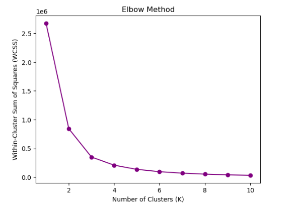

# 311-Service-Requests-Analysis

As a data analyst and newcomer to the vibrant city of Calgary, understanding and accessing the various services and information provided by the City is crucial. The 311 Service Requests system, offered by The City of Calgary’s Citizen Services division, serves as a comprehensive platform for residents, business owners, and visitors to connect with the city government and access non-emergency services. Through this system, individuals can submit requests, seek information, and track the progress of their inquiries or service needs. This data-driven exploration of Calgary’s 311 Service Requests aims to empower newcomers like myself and contribute to the continuous enhancement of city services.

This data story aims to uncover hidden narratives within the 311 Service Requests dataset and present a comprehensive understanding of the urban landscape. I will endeavor to address the following five key inquiries:

- What are the most common types of service requests received through the 311 system?
- Which city departments are responsible for resolving the majority of service requests?
- How does the volume of service requests vary over time? Are there any noticeable patterns or trends?
- Are there any geographical patterns or disparities in the distribution of service requests across different areas of the city?
- How does the response time vary overall and for different types of service requests?

## 311 Service Requests Dataset

The dataset includes essential details such as the request date, closure date, service channel, service name, and responsible department for each request. Additionally, it provides valuable information about the community, as well as the longitude and latitude coordinates associated with the location of the service request.

I analyzed a dataset consisting of 2,736,776 service requests recorded between 2018 and 2023. To ensure data quality, I performed basic data cleaning procedures to standardize the dataset. Specifically, I converted the date fields to the appropriate data type and extracted the year, month, and day of the week from the request dates. This allowed for a more comprehensive analysis of time-related insights in the data. I also extracted categories and subcategories from the ‘service name’ and ‘agency responsible’ fields. This extraction allowed for enhanced filtering options based on both main and subcategories.

It was noted that approximately 158,000 requests lacked information regarding their associated location. However, this information was intentionally left as is, as some services may not be connected to specific locations or may have been completed online. A small number of entries were found to be missing the ‘service name’ and ‘agency responsible’ fields. These rows were removed from the analysis since they lacked essential information for further examination.

## What are the most common types of service requests received through the 311 system?

Exploring the realm of service requests received through the 311 system, we discover a fascinating revelation: the most common types that stand out. By analyzing the frequency distribution of categories, we uncover the pulse of urban life. Below, you’ll find a bar chart depicting the top 10 categories of service requests.

<iframe src="service_categories.html" width="800" height="600" class="frameless-visualization"></iframe>

Road-related requests represent a significant portion, emphasizing the importance of maintaining a well-functioning transportation infrastructure. Building inspections, encompassing compliance and permits, highlight the community’s commitment to safety and construction standards. Requests for waste and recycling services reflect a dedication to environmental sustainability. Finance-related inquiries indicate an engaged community managing their financial obligations. Lastly, park-related requests demonstrate a desire to preserve and enhance outdoor spaces.

These insights reveal the active engagement and conscientiousness of residents towards their city. By actively requesting services related to roads, building inspections, waste management, finances, and parks, residents demonstrate their awareness and involvement in shaping the livability and sustainability of their community.

## Which city departments are responsible for resolving the majority of service requests?

Examining the departments responsible for handling service requests, three key insights come to light.

<iframe src="departments.html" width="800" height="600" class="frameless-visualization"></iframe>

The Calgary Community Standards department takes the lead, indicating the high priority given to maintaining community standards and regulations. Calgary Transit follows closely, underscoring the vital role of efficient and accessible public transportation in urban life. The Utilities & Environmental Protection department’s presence highlights the city’s commitment to sustainable practices and safeguarding the environment. These departments, among others, play a pivotal role in addressing resident concerns and actively shaping a vibrant and livable city.

## How does the volume of service requests vary over time? Are there any noticeable patterns or trends?

Delving into the vast realm of service requests, it’s intriguing to explore how the volume of these requests fluctuates over time. By examining the data and observing any discernible patterns, we can gain valuable insights into the dynamics of service demand.

<iframe src="requests_over_time.html" width="800" height="600" class="frameless-visualization"></iframe>

By analyzing the area map representation of service requests, an interesting pattern emerges. We observe a zigzag pattern, indicating that there is a yearly peak of requests during the middle of the year, which coincides with the summer months. Conversely, at the beginning and end of the year, the number of requests tends to decrease. This observation suggests a seasonality in service requests, with higher demand during the warmer months.

Let's take a closer look at the number of service requests in June and December of 2022.

<iframe src="june_december_requests.html" width="800" height="600" class="frameless-visualization"></iframe>

By examining the bar plot, it is evident that the number of requests is significantly higher in June compared to December. In particular, the Finance category shows a substantial increase in June, with subcategories such as "TIPP Agreement Request," "Property Tax Account Enquiry," and "Property Tax Document Request" experiencing a two to three-fold rise in requests.

Similarly, the Parks category also exhibits a notable surge in June, particularly in subcategories like "Tree Concern," "Mowing Request," "Maintenance," and "Infrastructure," which witnessed a significant increase in the number of service requests.

The heatmap below showcasing service requests by month and day of the week provides valuable insights into the workload distribution throughout the week.

<iframe src="month_day_requests.html" width="800" height="600" class="frameless-visualization"></iframe>

It vividly illustrates that during the weekends, the number of requests decreases, indicating a lighter workload. Conversely, the work weeks, particularly in June, appear to be busier, with a higher volume of requests. This visual matrix serves as a helpful tool for understanding potential patterns in request completion delays and identifying periods when additional staff may be required to efficiently handle the workload.

## Are there any geographical patterns or disparities in the distribution of service requests across different areas of the city?

To create a more informative representation of the distribution of requests among different communities, I decided to incorporate a geospatial dataset containing community boundaries. By merging this dataset with my request data, I was able to generate a map that highlights the spatial distribution and intensity of requests across various communities. The color of each area represents the intensity of requests, providing a visual representation of the varying levels of activity across the communities. The additional information can be found in the tooltip.

<iframe src="requests_map.html" width="800" height="1000" class="frameless-visualization"></iframe>

Upon analyzing the map, it becomes evident that the communities located in the city center, namely the Downtown Commercial Core (DNC) and Beltline (BLN), exhibit the highest concentration of service requests. This observation is not surprising, considering the bustling nature of these central areas, with numerous businesses, offices, and residential complexes.

Interestingly, we also observe a considerable number of requests in the community of Bowness (BOW). This community is noteworthy for being home to one of Calgary’s most popular parks, which attracts a large number of visitors. The higher volume of requests in this area could be attributed to the park’s popularity and the associated maintenance and service requirements.

Another community that stands out in terms of service requests is Saddle Ridge (SAD). While not located in the city center, it appears to have a significant demand for services. This could be due to various factors, such as population density, commercial establishments, or specific community needs.

## How does the response time vary overall and for different types of service requests?

To analyze the overall trend in the distribution of time spent on handling service requests, a violin plot was created. The violin plot provides a visual representation of the distribution of time spent by showing the density of data points at different values.

The time spent on handling the requests was calculated by taking the difference between the Request date and Closed date. This calculation provides an estimate of the duration it takes to resolve each service request.

The summary statistics reveal:

- Count: The number of non-null values in the dataset is approximately 2,676,861.
- Mean: The average time taken to complete a service request is approximately 436.40 hours (approximately 18 days).
- Standard Deviation (Std): The standard deviation is approximately 2,114.54 hours (approximately 88 days).
- Minimum (Min): The minimum value of time_diff_hours is 0 hours (0 days), indicating that there are some service requests that were completed immediately.
- 25th Percentile (25%): 25% of the data points have a time_diff_hours value of 23.51 hours or less. This represents the lower quartile or the first quartile.
- 50th Percentile (50% or Median): 50% of the data points have a time_diff_hours value of 70.68 hours (approximately 3 days) or less. This is the median value and represents the midpoint of the distribution.
- 75th Percentile (75%): 75% of the data points have a time_diff_hours value of 168 hours (approximately 7 days) or less. This represents the upper quartile or the third quartile.
- Maximum (Max): The maximum value of time_diff_hours is 46,704 hours (approximately 1,946 days or 5 years), indicating that there are some service requests that took a significantly longer time to complete.

These statistics provide an overview of the distribution of time taken to complete service requests, including the average, spread, and quartiles of the data, now expressed in both hours and days.

Clustering based on completion time of request were employed to gain insights into patterns and group service requests according to their time of completion.

Cluster 0: Count=2627612, Average Time Diff=205.25445648162906 hours

Cluster 2: Count=41153, Average Time Diff=9440.382644118896 hours

Cluster 1: Count=8096, Average Time Diff=29678.166996047425 hours

The Elbow method was used to find the optimal number of clusters for grouping service requests based on completion time. After analyzing the plot, it was determined that dividing the data into 3 clusters captured a significant amount of variation, making it a suitable choice for clustering.

The analysis divides the service requests into three clusters based on completion time. Cluster 0 has the most requests (over 2.6 million) with an average completion time of around 205 hours (≈ 8.5 days). Cluster 2 has a moderate number of requests (41,153) and the average completion time of approximately 9,440 hours (≈ 13 months). Cluster 1 has the fewest requests (8,096) but the longest average completion time of about 29,678 hours (≈ 3.3 years). Below, you can observe the boxplots that depict the distribution of time spent on completing service requests, based on these three classes.

There are 86 unique categories of service requests. Next, I examine if specific service request categories can be grouped based on completion time or if there is no clear relationship between category and completion time. The arrays of categories between three classes were compared.

The services above (21 categories from 86) are distinct to Cluster 0, indicating that they are predominantly associated with this cluster and their average completion time is of around 205 hours or ≈ 8.5 days.

The 21 categories such as ‘Finance’, ‘City Clerk’s’, ‘Road permits, and others are specifically associated with both Cluster 0 and Cluster 2. Therefore, on average, the completion times for these service requests range from approximately 205 hours (8.5 days) to 9,440 hours (13 months).

Out of the 86 service request categories, the remaining 44 categories are present in each of the three clusters. These categories have completion times ranging from 205 hours (approximately 9 days) to 29,678 hours (approximately 3.3 years). This indicates a significant variation in the completion times for these categories.

## Conclusion

In conclusion, this data analysis of Calgary’s 311 Service Requests provides valuable insights into the urban landscape and residents’ engagement with city services. The analysis addresses key inquiries related to the types of service requests, responsible city departments, volume and patterns of requests over time, geographical distribution, and response time.

The most common types of service requests include road-related issues, building inspections, waste and recycling services, finance-related inquiries, and park-related requests. These highlight the community’s focus on transportation infrastructure, safety standards, environmental sustainability, financial management, and outdoor spaces.

The Calgary Community Standards department, Calgary Transit, and the Utilities & Environmental Protection department play significant roles in resolving the majority of service requests. This underscores the importance of maintaining community standards, providing efficient public transportation, and emphasizing sustainable practices.

The volume of service requests exhibits seasonality, with higher demand during the summer months. There is also a higher workload during weekdays compared to weekends, indicating potential patterns in request completion delays and resource allocation.

Geographically, the Downtown Commercial Core and Beltline areas demonstrate the highest concentration of service requests, reflecting their vibrant nature with numerous businesses and residential complexes. Bowness, known for its popular park, and Saddle Ridge, possibly due to various factors like population density, also stand out in terms of service requests.

The response time for resolving service requests shows significant variation, with an average of approximately 500 hours. Clustering based on completion time reveals three clusters, with Cluster 0 having the most requests and the shortest average completion time, Cluster 1 having the fewest requests and the longest completion time, and Cluster 2 falling in between.

Residents often seek timely resolutions to their inquiries or service needs. However, without an understanding of how long it may take to address their specific request, they may feel frustrated or uncertain about the progress. By establishing time frames for different categories of services, residents can have a better understanding of the expected turnaround time for their specific type of request.

For example, road-related requests may have a shorter time frame since they often require immediate attention to ensure public safety and maintain smooth traffic flow. On the other hand, more complex requests, such as building inspections or regulatory affairs, may involve multiple steps or involve coordination with different departments, requiring a longer time frame for completion.

Implementing time frames can also benefit city departments by providing them with a framework to prioritize and allocate resources effectively. By having a clear understanding of the expected completion times for different categories of services, departments can manage their workload, streamline processes, and optimize their service delivery.

## References

City of Calgary. (2023). 311 Service Requests. Retrieved from https://data.calgary.ca/Services-and-Amenities/311-Service-Requests/iahh-g8bj

City of Calgary. (2023). Community District Boundaries. Retrieved from Calgary Open Data Portal: https://data.calgary.ca/Base-Maps/Community-District-Boundaries/surr-xmvs

## Data Analysis Contributors:
<a href="https://www.linkedin.com/in/laura-assylgazhina/">Laura Assylgazhina</a>

